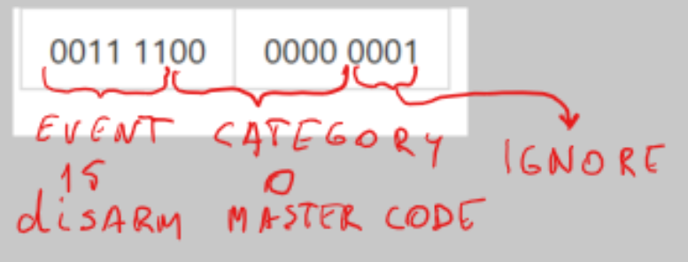

# Paradox Spectra 1738 Serial Output Reverse Engineering
Reverse engineering of Paradox Spectra 1738 Security System Serial Output. Reading the serial stream with Raspberry PI.


## <div align=center>Paradox Spectra 1738 serial output</div>
Spectra 1738 serial output is 4 bytes. Look at the tables by the end of this doument.

- **Bytes 1 and 2** are event and category.
- **Bytes 3 and 4** are clock.

## <div align=center>Connect Paradox serial output to Raspberry PI</div>
To read Paradox security messages by Raspberry PI we have to connect these two hardware devices.<br/> 
Both devices have a serial input/output IO (COM ports). Serial interface is using one wire to send data
and another wire to receive data. 
As it is unknown how to send commands to Paradox we need only one wire for communication. 
Obviously we need additional wire for ground connection.
Data transmitted from Paradox Tx pin (transmit) to Raspberry Rx pin (receive).<br/>
As Paradox Tx output is 5V and Raspberry Rx is 3,3V we can't connect them directly.<br/>
**DO NOT CONNECT Tx directly to Rx, this will damage your Raspberry!**<br/>
Usual recommendation is to use a special 5v to 3,3v converter. 
As I do not have this converter and the electric current is very small then simple voltage divider with a two resistors is good to go.


---
## <div align=center>Read serial messages in Raspberry </div>

This is my very first project to deal with a COM-port and serial messages. Therefore I start at the beginning and
creating a foreach loop to see is there any COM-ports presented in my Raspberry. 
#### Find Raspberry COM port
This `foreach` loop list all available COM-ports presented by Raspberry.
If there is no COM-port available then this have to be enabled from the Raspberry global settings `raspi-config`.
Keep in mind that `SerialPort` is exist in `System.IO.Ports` which can be downloaded as a NuGet package.

```C#
string[] ports = SerialPort.GetPortNames();
Console.WriteLine("The following serial ports are found:");
foreach (string port in ports)
{
    Console.WriteLine(port);
}
// The following serial ports are found:
// /dev/ttyAMA0
```
#### Create and open COM port
The next task is to write some lines of code to create a COM port which can be used to read serial messages.

```C#
string ComPort = "/dev/ttyAMA0";
int baudrate = 9600;
Console.WriteLine($"serial: {ComPort} {baudrate}");
_serialPort = new SerialPort(ComPort, baudrate);
_serialPort.Open();
```
#### Read serial messages 
As Paradox message length is exactly 4 bytes they needs to be read in batches of 4 bytes. 
Following piece of code is doing exactly this and the data stream is saved into byte array `DataStream[]`.

The rest of the work is simple reading these bytes and do some smart decisions. What does each of the byte
are doing is explained in this project.

What I dont know is why the following code is not working without `try catch` statement. 
But actually I dont care unless the code is working.

```C#
byte[] DataStream = new byte[4];
byte index = 0;
while (true)
{
try
{
    //Spectra message output is always 4 bytes
    if (_serialPort.BytesToRead < 4)
    {
        index = 0;
        while (index < 4)
        {
            DataStream[index++] = (byte)_serialPort.ReadByte();
        }
    }
}
catch (Exception e) { Console.WriteLine($"Timeout {e}"); }
}
```
---
## <div align=center>Byte 1 and 2: Event and Category</div>
Byte1 and Byte2 has to be considered like an one 16 bit number. All events and categories are based on these numbers.
It is very important not to take byte1 as an event and byte2 as a category. 

* Bits 1-4 can be igored
* Bits 5-10 are for Categories
* Bits 11-16 are for Events

|Byte1|Byte2|
|---|---|
|0000 0000| 0000 0000 |



```C#
int EventId = DataStream[0] >> 2;
int CategoryId = ((DataStream[0] & 3) << 4) + (DataStream[1] >> 4);
```

---
## <div align=center>Event</div>

Events can be categorized into 10 main subcategory like zones, troubles, statuses, Access Codes etc.


```C#
int EventCategory = events.Where(x => x.EventId == EventId).Select(x => x.EventCategory).DefaultIfEmpty(EventId).First();

bool isZoneEvent = EventCategory == Category.ZONE;
bool isStatus = EventCategory == Category.STATUS;
bool isTrouble = EventCategory == Category.TROUBLE;
bool isAccessCode = EventCategory == Category.ACCESS_CODE;
bool isSpecialAlarm = EventCategory == Category.SPECIAL_ALARM;
bool isSpecialArm = EventCategory == Category.SPECIAL_ARM;
bool isSpecialDisarm = EventCategory == Category.SPECIAL_DISARM;
bool isNonReportEvents = EventCategory == Category.NON_REPORT_EVENTS;
bool isSpecialReport = EventCategory == Category.SPECIAL_REPORT;
bool isRemoteControl = EventCategory == Category.REMOTE_CONTROL;
```
---
## <div align=center>Category</div> 

Categories are like zone numbers, access codes, status info, trouble info, some sort of reportings etc.

All the categories are explained below in the table. 
The table has a complete set of categories what Paradox Spectra 1738 can report.
This demo project will print all the events and categories. 
```C#
if (isStatus) Message = PartitionStatuses.Where(x => x.CategoryId == CategoryId).Select(x => x.Name).DefaultIfEmpty($"Status_{CategoryId}").First();
if (isTrouble) Message = SystemTroubles.Where(x => x.CategoryId == CategoryId).Select(x => x.Name).DefaultIfEmpty($"Trouble_{CategoryId}").First();
if (isSpecialAlarm) Message = SpecialAlarms.Where(x => x.CategoryId == CategoryId).Select(x => x.Name).DefaultIfEmpty($"SpecialAlarm_{CategoryId}").First();
if (isSpecialArm) Message = SpecialArms.Where(x => x.CategoryId == CategoryId).Select(x => x.Name).DefaultIfEmpty($"SpecialArm_{CategoryId}").First();
if (isSpecialDisarm) Message = SpecialDisarms.Where(x => x.CategoryId == CategoryId).Select(x => x.Name).DefaultIfEmpty($"SpecialDisarm_{CategoryId}").First();
if (isNonReportEvents) Message = NonReportableEvents.Where(x => x.CategoryId == CategoryId).Select(x => x.Name).DefaultIfEmpty($"NonReportEvent_{CategoryId}").First();
if (isSpecialReport) Message = SpecialReportings.Where(x => x.CategoryId == CategoryId).Select(x => x.Name).DefaultIfEmpty($"SpecialReporting_{CategoryId}").First();

Console.Write($"{Event}, {Message}");
Console.WriteLine();

```

There are two special subcategories Zones and Access Codes.

**Zones** list has two additional attributes `ZoneEventTime` and boolean `IsZoneOpen` 
to determine later or from other code if the zone is open or closed.
These values will be written back to the list every time the zone is accessed.
```C#
if (isZoneEvent)
{
    bool IsZoneOpen = false;
    if (EventId == 1) IsZoneOpen = true;
    //update existing list with the IR statuses and activating/closing time
    Zones.Where(x => x.CategoryId == CategoryId).Select(x => { x.IsZoneOpen = IsZoneOpen; x.ZoneEventTime = DateTimeOffset.Now; return x; }).ToList();
    Message = Zones.Where(x => x.CategoryId == CategoryId).Select(x => $"{x.ZoneName}").DefaultIfEmpty($"Zone_{CategoryId}").First();
}

```

**Access Codes** is a second special list as they are numbered from 001-048. First three are master codes
and the last one is a special Duress Code to send quiet alarm. 

The method `GetAccessCode(int code)` is calculating correct User Access code.
```C#
public static string GetAccessCode(int code)
{
    string AccessCode = code < 10 ? $"User Code 00{code}" : $"User Code 0{code}";
    if (code == 1) AccessCode = "Master code";
    if (code == 2) AccessCode = "Master Code 1";
    if (code == 3) AccessCode = "Master Code 2";
    if (code == 48) AccessCode = "Duress Code";
    return AccessCode;
}

```

Following is the output of this program.


---
## <div align=center>Bytes 3 and 4: Clock</div>

One of the challenging reverse engineering task was to figure out how the clock is working. 

#### Algorithm

* Bits 1-4 are always zeros.
* Bits 5-10 are minute.
* Bit 11 is zero.
* Bits 12-16 are hour.

|0000 |0000 | 0000 | 0000 |
|-|-|-|-|
|HHHH |H0mm | mmmm | 0000 |

Graphical view of this.


This is my project of the Clock with the generator.<br/>
https://github.com/LeivoSepp/Octal-Clock-Two-Bytes-24h 

Some time examples:
* time 23:59 is in Octal 273 260 and in Hex 0xBB 0xB0.
* time 8:00 is in Octal 100 and in Hex 0x08.
* time 20:00 is in Otal 240 and in Hex 0xA0.

The final solution is a geniusly simple as it has just two lines of code 
for hours and minutes with binary shift operations.
```C#
int msb = DataStream[2];
int lsb = DataStream[3];

//getting minute and hour with shift operations
int hour = msb >> 3;
int minute = ((msb & 3) << 4) + (lsb >> 4);
string paradoxTime = $"{(hour < 10 ? $"0{hour}" : $"{hour}")}:{(minute < 10 ? $"0{minute}" : $"{minute}")}";
```

The actual outcome of this task is completely useless as it reads just the time reported by Paradox panel (24h format). 
After integration with Home Automation the clock is managed anyway by Rasperry PI and will taken and sychronized from the internet. 

## Paradox serial output messages with all codes

|EventId|Description|CategoryId|Description|
|--:|:--|--:|---|
|1|Zone OK|1-16|Zones 1-16|
|2|Zone Open|1-16|Zones 1-16|
|3|Partition Status|0<br/>1<br/>2<br/>3<br/>4<br/>5<br/>6<br/>7<br/>8<br/>9<br/>10<br/>11|System not ready<br/>System ready<br/>Steady alarm<br/>Pulsed alarm<br/>Pulsed or Steady Alarm<br/>Alarm in partition restored<br/>Bell Squawk Activated<br/>Bell Squawk Deactivated<br/>Ground start<br/>Disarm partition<br/>Arm partition<br/>Entry delay started|
|5|Non-Reportable events|0<br/>1<br/>2<br/>3<br/>4<br/>5<br/>6<br/>7|Telephone Line Trouble<br/>Reset smoke detectors<br/>Instant arming<br/>Stay arming<br/>Force arming<br/>Fast Exit (Force & Regular Only)<br/>PC Fail to Communicate<br/>Midnight|
|6|Arm/Disarm with Remote Control|1-8|Remote Controls 1-8|
|7|Button Pressed on Remote (B)|1-8|Remote Controls 1-8|
|8|Button Pressed on Remote (C)|1-8|Remote Controls 1-8|
|9|Button Pressed on Remote (D)|1-8|Remote Controls 1-8|
|10|Bypass programming|1-48|Access Codes 001-048|
|11|User Activated PGM|1-48|Access Codes 001-048|
|12|Zone with delay transmission<br/>option enabled is breached|1-16|Zones 1-16|
|13|Arm|1-48|Access Codes 001-048|
|14|Special arm|0<br/>1<br/>2<br/>3<br/>4<br/>5<br/>7|Auto arming (timed/no movement)<br/>Late to Close (Auto-Arming failed)<br/>No Movement Auto-Arming<br/>Partial Arming (Stay, Force, Instant, Bypass)<br/>One-Touch Arming<br/>Arm with WinLoad Software<br/>Closing Delinquency|
|15|Disarm|1-48|Access Codes 001-048|
|16|Disarm after alarm|1-48|Access Codes 001-048|
|17|Cancel alarm|1-48|Access Codes 001-048|
|18|Special Disarm|0<br/>1<br/>2<br/>3|Cancel Auto Arm (timed/no movement)<br/>Disarm with WinLoad Software<br/>Disarm after alarm with WinLoad Software<br/>Cancel Alarm with WinLoad Software|
|19|Zone Bypassed on arming||Zones table|
|20|Zone in alarm|1-16|Zones 1-16|
|21|Fire alarm|1-16|Zones 1-16|
|22|Zone alarm restore|1-16|Zones 1-16|
|23|Fire alarm restore|1-16|Zones 1-16|
|24|Special alarm|0<br/>1<br/>2<br/>3<br/>4<br/>5<br/>6|Emergency, keys [1] [3]<br/>Auxiliary, keys [4] [6]<br/>Fire, keys [7] [9]<br/>Recent closing<br/>Auto Zone Shutdown<br/>Duress alarm<br/>Keypad lockout|
|25|Auto zone shutdown|1-16|Zones 1-16|
|26|Zone tamper|1-16|Zones 1-16|
|27|Zone tamper restore|1-16|Zones 1-16|
|28<br/>29|System Trouble<br/>System Trouble restore|1<br/>2<br/>3<br/>4<br/>5<br/>6<br/>7<br/>8<br/>9<br/>10<br/>11|AC Loss<br/>Battery Failure<br/>Auxiliary current overload<br/>Bell current overload<br/>Bell disconnected<br/>Timer Loss<br/>Fire Loop Trouble<br/>Future use<br/>Module Fault<br/>Printer Fault<br/>Fail to Communicate|
|30|Special reporting|0<br/>1<br/>2<br/>3<br/>4<br/>5|System power up<br/>Test report<br/>WinLoad Software Access<br/>WinLoad Software Access finished<br/>Installer enters programming mode<br/>Installer exits programming mode|
|31|Wireless Transmitter<br/>Supervision Loss|1-16|Zones 1-16|
|32|Wireless Transmitter<br/>Supervision Loss Restore|1-16|Zones 1-16|
|33|Arming with a Keyswitch|1-16|Zones 1-16|
|34|Disarming with a Keyswitch|1-16|Zones 1-16|
|35|Disarm after Alarm with a Keyswitch|1-16|Zones 1-16|
|36|Cancel Alarm with a Keyswitch|1-16|Zones 1-16|
|37|Wireless Transmitter<br/>Low Battery|1-16|Zones 1-16|
|38|Wireless Transmitter<br/>Low Battery Restore|1-16|Zones 1-16|


## Reverse engineering with oscilloscope
This is my first experiment with serial communication. I never worked before with COM-technology.

First task was to connect my digital oscsilloscope directly to Paradox Tx serial output.
When I figured out which pin is the Tx and started to see real packets on my laptop screen I enjoyed this like a child.
The next task was to understand the packets size and they were exactly 4 bytes. 

This was my new toy. I was asking my wife to open and close the door, 
move around different rooms and I was just sitting in front of the screen and looking the packets.


I realized very quickly some data patterns of opening and closing sensors. Initially I was thinking that bytes 3-4
doesn't mean anything as they changed with no pattern at all. Somehow I started to look also watch and I saw that they are changing in every minute.

**This was the magic.**


## Security system and Home Automation
The next task is to integrate the Paradox with my Home Automation Raspberry PI through the COM port. 

#### What is the benefit of the integration?
Everything can be automated which is related to human presence in house.

I have already implemented following scenarios.
* **Garden lights.** If someone is at home then garden lights are turned on automatically. Algorithm is the following.
  * Lights are turned on in between sunset and sunrise.
  * Lights are turned off during sleeping time 00:00_07:00
  * Lights are turned off if nobody is at home in 1 hour. Detected by IR detectors.
* **Entry-Exit patterns.** If someone leaves or enters the house then the direction of movement is detected and reported to home automation. 
* **Security messages.** If home is secured (by Home Automation and not by the Paradox) I will get immediately notification if someone is moving in house.

New ideas of using this Paradox integration.
* Some lights can be turned on/off automatically in house.
  * Corridor light will be the first one. I really miss that.
  * Hall light and some others which needs to be turned on temporarily. 

*Automatic garden lights by Home Automation based on Paradox Spectra and IR detectors.*


#### Historical integration (holy mess)
The historical integration was done in very difficult way. 

All sensors are connected physically to IC MCP23017 which is a 16 bit parallel I/O expansion.
MCP23017 was connected to Raspberry by I2C protocol. 
Program was looping these ports in every second to find IR detectors interruptions.

With the new serial port connection I can get rid of hundreds of wires to replace them just with two wires. 
I took some pictures of nice this old mess. It was working already many years like this. 


### Resources used during the project
Serial Port Programming With .NET.
Good resource for beginner to understand how to read serial messages.<br/>
https://www.instructables.com/Serial-Port-Programming-With-NET/

Serial Communication with .NET Core 3.0 on RPi Linux.
Good build and publish scripts.<br/>
https://dev.to/azure/net-core-iot-raspberry-pi-linux-and-azure-iot-hub-learn-how-to-build-deploy-and-debug-d1f <br/>
https://www.hackster.io/sxwei123/serial-communication-with-net-core-3_0-on-rpi-linux_0f2ed4

Overall serial communication explanation.<br/>
https://learn.sparkfun.com/tutorials/serial-communication/all

Picoscope oscilloscope for serial communication. <br/>
https://www.picotech.com/download/datasheets/MM043_PicoScope_Serial_Decoding_Data_Sheet.pdf

Paradox home security hacking for newest devices. Useless to me <br/>
https://harizanov.com/2014/07/interfacing-with-paradox-home-security-system-attempt-2/

This project is useless to me as well as it is only for newest systems.<br/>
https://github.com/ParadoxAlarmInterface

Raspberry Tx->Rx (5v->3.3v)<br/>
https://www.raspberrypi.org/forums/viewtopic.php?t=94042 <br/>

Setup WSL (Windows Subsystem for Linux)<br/>
https://docs.microsoft.com/en-us/windows/wsl/install-win10?WT.mc_id=devto-blog-dglover <br/>
Raspberry headless setup<br/>
https://desertbot.io/blog/headless-raspberry-pi-3-bplus-ssh-wifi-setup <br/>