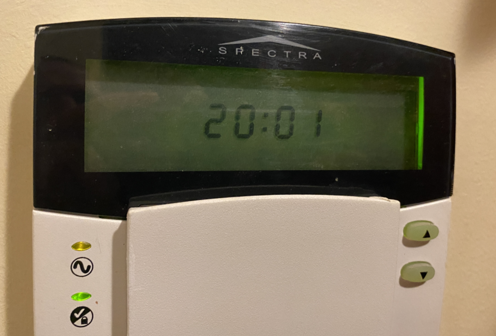
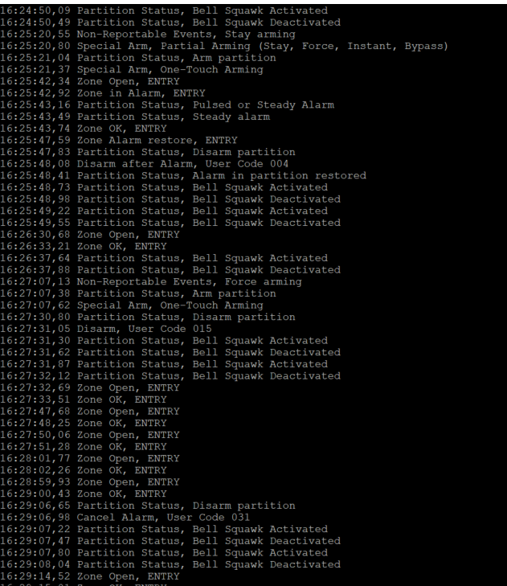
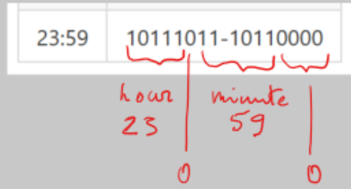

# Paradox Spectra 1738 Serial Output Reverse Engineering
Reverse engineering of Paradox Spectra 1738 Security System Serial Output. Reading the serial stream with Raspberry PI.


## <div align=center>Paradox Spectra 1738 serial output</div>
Spectra 1738 serial output is 4 bytes. Look at the tables by the end of this doument.

- **Byte 1** is an event.
- **Byte 2** is a sub-category like zone number, access code, status, trouble info.
- **Byte 3, Byte 4** are used for clock.

## <div align=center>Connect Paradox serial output to Raspberry PI</div>
To read Paradox security messages by Raspberry PI we have to connect these two hardware devices.<br/> 
Both devices have a serial input/output IO (COM ports). Serial interface is using one wire to send data
and another wire to receive data. 
As it is unknown how to send commands to Paradox we need only one wire for communication. 
Obviously we need additional wire for ground connection.
Data transmitted from Paradox Tx pin (transmit) to Raspberry Rx pin (receive).<br/>
As Paradox Tx output is 5V and Raspberry Rx is 3,3V we can't connect them directly.<br/>
**DO NOT CONNECT Tx directly to Rx, this will damage your Raspberry!**<br/>
Usual recommendation is to use a special 5v to 3,3v converter. 
As I do not have this converter and the electric current is very small then simple voltage divider with a two resistors is good to go.


---
## <div align=center>Read serial messages in Raspberry </div>

This is my very first project to deal with a COM-port and serial messages. Therefore I start at the beginning and
creating a foreach loop to see is there any COM-ports presented in my Raspberry. 
#### Find Raspberry COM port
This `foreach` loop list all available COM-ports presented by Raspberry.
If there is no COM-port available then this have to be enabled from the Raspberry global settings `raspi-config`.
Keep in mind that `SerialPort` is exist in `System.IO.Ports` which can be downloaded as a NuGet package.

```C#
string[] ports = SerialPort.GetPortNames();
Console.WriteLine("The following serial ports are found:");
foreach (string port in ports)
{
    Console.WriteLine(port);
}
// The following serial ports are found:
// /dev/ttyAMA0
```
#### Create and open COM port
The next task is to write some lines of code to create a COM port which can be used to read serial messages.

```C#
string ComPort = "/dev/ttyAMA0";
int baudrate = 9600;
Console.WriteLine($"serial: {ComPort} {baudrate}");
_serialPort = new SerialPort(ComPort, baudrate);
_serialPort.Open();
```
#### Read serial messages 
As Paradox message length is exactly 4 bytes they needs to be read in batches of 4 bytes. 
Following piece of code is doing exactly this and the data stream is saved into byte array `DataStream[]`.

The rest of the work is simple reading these bytes and do some smart decisions. What does each of the byte
are doing is explained in this project.

What I dont know is why the following code is not working without `try catch` statement. 
But actually I dont care unless the code is working.

```C#
byte[] DataStream = new byte[4];
byte index = 0;
while (true)
{
try
{
    //Spectra message output is always 4 bytes
    if (_serialPort.BytesToRead < 4)
    {
        index = 0;
        while (index < 4)
        {
            DataStream[index++] = (byte)_serialPort.ReadByte();
        }
    }
}
catch (Exception e) { Console.WriteLine($"Timeout {e}"); }
}
```
---
## <div align=center>Byte 1: Event</div>

Byte 1 is an event. Each event have a subcategory which is a byte2. There are many events and they can 
be categorized into 10 category like zones, troubles, statuses etc.

Within deeper reverse engineering I figured out that each event (or event group like different Access Codes) 
will start after 4 bytes. After realizing that pattern the rest of the work was relatively simple to map all events with correct codes.

Each of the category has it's own boolean to identify correct subcategory.

```C#
string Byte1id = DataStream[0].ToString("X2");
string Event = events.Where(x => x.Byte1 == Byte1id).Select(x => x.EventName).DefaultIfEmpty($"Event_{Byte1id}").First();
int EventCategory = events.Where(x => x.Byte1 == Byte1id).Select(x => x.EventCategory).DefaultIfEmpty(DataStream[0]).First();

bool isZoneEvent = EventCategory == Category.ZONE;
bool isStatus = EventCategory == Category.STATUS;
bool isTrouble = EventCategory == Category.TROUBLE;
bool isAccessCode = EventCategory == Category.ACCESS_CODE;
bool isSpecialAlarm = EventCategory == Category.SPECIAL_ALARM;
bool isSpecialArm = EventCategory == Category.SPECIAL_ARM;
bool isSpecialDisarm = EventCategory == Category.SPECIAL_DISARM;
bool isNonReportEvents = EventCategory == Category.NON_REPORT_EVENTS;
bool isSpecialReport = EventCategory == Category.SPECIAL_REPORT;
bool isRemoteControl = EventCategory == Category.REMOTE_CONTROL;
```
---
## <div align=center>Byte 2: Sub-Category</div> 

Byte 2 is a category like zone number, access code, status info, trouble info, some sort of reporting etc.

All the subcategories are explained below in the table. 
The table has a complete set of subcategories what Paradox Spectra 1738 can report.
This demo project will print all the events and subcategories. Each subcategory has its own list.
```C#
if (isStatus) Message = PartitionStatuses.Where(x => x.Byte2 == Byte2id).Select(x => x.Name).DefaultIfEmpty($"Status_{Byte2id}").First();
if (isTrouble) Message = SystemTroubles.Where(x => x.Byte2 == Byte2id).Select(x => x.Name).DefaultIfEmpty($"Trouble_{Byte2id}").First();
if (isSpecialAlarm) Message = SpecialAlarms.Where(x => x.Byte2 == Byte2id).Select(x => x.Name).DefaultIfEmpty($"SpecialAlarm_{Byte2id}").First();
if (isSpecialArm) Message = SpecialArms.Where(x => x.Byte2 == Byte2id).Select(x => x.Name).DefaultIfEmpty($"SpecialArm_{Byte2id}").First();
if (isSpecialDisarm) Message = SpecialDisarms.Where(x => x.Byte2 == Byte2id).Select(x => x.Name).DefaultIfEmpty($"SpecialDisarm_{Byte2id}").First();
if (isNonReportEvents) Message = NonReportableEvents.Where(x => x.Byte2 == Byte2id).Select(x => x.Name).DefaultIfEmpty($"NonReportEvent_{Byte2id}").First();
if (isSpecialReport) Message = SpecialReportings.Where(x => x.Byte2 == Byte2id).Select(x => x.Name).DefaultIfEmpty($"SpecialReporting_{Byte2id}").First();

Console.Write($"{Event}, {Message}");
Console.WriteLine();

```

There are two special subcategories Zones and Access Codes.

**Zones** list has two additional attributes `ZoneEventTime` and boolean `IsZoneOpen` to determine if the zone is open or closed.
These values will be written back to the list every time when the zone accessed.
```C#
if (isZoneEvent)
{
    //save the IRState into zone's list
    bool IsZoneOpen = false;
    if (Byte1id == "04") IsZoneOpen = true;
    //update existing list with the IR statuses and activating/closing time
    Zones.Where(x => x.Byte2 == Byte2id).Select(x => { x.IsZoneOpen = IsZoneOpen; x.ZoneEventTime = DateTimeOffset.Now; return x; }).ToList();
    Message = Zones.Where(x => x.Byte2 == Byte2id).Select(x => $"{x.ZoneName} {(x.IsZoneOpen ? "Open" : "Closed")}").DefaultIfEmpty($"Zone_{Byte2id}").First();
}

```

**Access Codes** are second special list as they are numbered from 001-048 where first three are master codes
and the last one is special Duress Code to disarm and send quiet alarm. These 48 codes are used in block
of event which is 4 bytes. For example arming Access Codes are divided into events 0x34 0x35 0x36 0x37. 
Each of the event number will have it's own subcategory with pre-defined amount of User Access codes. 

Example: Arm event 0x34 have subcategory with numbers 0x11 0x21 0x31 ... 0xF1 and each of the subcategory number represents one Access Code 001...015.

Example 2: Disarm event 0x3F has only one subcategory with a number 0x01 which represents Access Code 048 (Duress Code).

The method `GetAccessCode(Byte1id, Byte2id)` is calculating correct User Access code.
```C#
public static string GetAccessCode(string Byte1, string Byte2)
{
    int count = 0;
    bool found = false;
    string[] AccessCodeStart = new string[6] { "28", "2C", "34", "3C", "40", "44" };
    for (int i = 0; i < AccessCodeStart.Length; i++)
    {
        var startCode = Convert.ToInt32(AccessCodeStart[i], 16);
        for (int j = 0; j < 4; j++)
        {
            var code = (startCode + j).ToString("X2");
            if (Byte1 == code)
            {
                count = j;
                found = true;
                break;
            }
        }
        if (found) break;
    }
    var byte2 = Convert.ToInt32(Byte2, 16);
    int output = byte2 / 16 + count * 16;
    string AccessCode = output < 10 ? $"User Code 00{output}" : $"User Code 0{output}";
    if (count == 0)
    {
        switch (output)
        {
            case 1:
                AccessCode = "Master code";
                break;
            case 2:
                AccessCode = "Master Code 1";
                break;
            case 3:
                AccessCode = "Master Code 2";
                break;
        }
    }
    if (count == 3)
        AccessCode = "Duress Code";
    return AccessCode;
}
```

Following is the output of this program.



---
## <div align=center>Bytes 3 and 4: Clock</div>

One of the challenging reverse engineering task was to figure out how the clock is working. 

#### Two bytes for a clock

These two bytes has to be a clock but I didn't know how?

Byte1 : Byte2 = 0000 0000 : 0000 0000

#### Algorithm

* Bits 1-4 are always zeros.
* Bits 5-10 are minute.
* Bit 11 is zero.
* Bits 12-16 are hour.

|0000 |0000 | 0000 | 0000 |
|-|-|-|-|
|HHHH |H0mm | mmmm | 0000 |

Graphical view of this.



This is my project of the Clock with the generator.<br/>
https://github.com/LeivoSepp/Octal-Clock-Two-Bytes-24h 

Some time examples:
* time 23:59 is in Octal 273 260 and in Hex 0xBB 0xB0.
* time 8:00 is in Octal 100 and in Hex 0x08.
* time 20:00 is in Otal 240 and in Hex 0xA0.

The final solution is a geniusly simple as it has just two lines of code 
for hours and minutes with binary shift operations.
```C#
int msb = DataStream[2];
int lsb = DataStream[3];

//getting minute and hour with shift operations
int hour = msb >> 3;
int minute = ((msb & 3) << 4) + (lsb >> 4);
string paradoxTime = $"{(hour < 10 ? $"0{hour}" : $"{hour}")}:{(minute < 10 ? $"0{minute}" : $"{minute}")}";
```

The actual outcome of this task is completely useless as it reads just the time reported by Paradox panel (24h format). 
After integration with Home Automation the clock is managed anyway by Rasperry PI and will taken and sychronized from the internet. 

## Paradox serial output messages with all codes

|Byte_1<br/>Hex|Event|Byte_2<br/>Hex|Sub-Group|
|---|---|---|---|
|0x00|Zone OK||Zones table|
|0x04|Zone Open||Zones table|
|0x08|Partition Status|0x01<br/>0x11<br/>0x21<br/>0x31<br/>0x41<br/>0x51<br/>0x61<br/>0x71<br/>0x81<br/>0x91<br/>0xA1<br/>0xB1|System not ready<br/>System ready<br/>Steady alarm<br/>Pulsed alarm<br/>Pulsed or Steady Alarm<br/>Alarm in partition restored<br/>Bell Squawk Activated<br/>Bell Squawk Deactivated<br/>Ground start<br/>Disarm partition<br/>Arm partition<br/>Entry delay started|
|0x14|Non-Reportable events|0x01<br/>0x11<br/>0x21<br/>0x31<br/>0x41<br/>0x51<br/>0x61<br/>0x71|Telephone Line Trouble<br/>Reset smoke detectors<br/>Instant arming<br/>Stay arming<br/>Force arming<br/>Fast Exit (Force & Regular Only)<br/>PC Fail to Communicate<br/>Midnight|
|0x18|Arm/Disarm with Remote Control||Remote Controls 1-8|
|0x1C|Button Pressed on Remote (B)||Remote Controls 1-8|
|0x20|Button Pressed on Remote (C)||Remote Controls 1-8|
|0x24|Button Pressed on Remote (D)||Remote Controls 1-8|
|0x28<br/>0x29<br/>0x2A<br/>0x2B|Bypass programming|0x11_0xF1<br/>0x01_0xF1<br/>0x01_0xF1<br/>0x01|Access Codes 001_015<br/>Access Codes 016_031<br/>Access Codes 032_047<br/>Access Code 048|
|0x2C<br/>0x2D<br/>0x2E<br/>0x2F|User Activated PGM|0x11_0xF1<br/>0x01_0xF1<br/>0x01_0xF1<br/>0x01|Access Codes 001_015<br/>Access Codes 016_031<br/>Access Codes 032_047<br/>Access Code 048|
|0x30|Zone with delay transmission<br/>option enabled is breached||Zones table|
|0x34<br/>0x35<br/>0x36<br/>0x37|Arm|0x11_0xF1<br/>0x01_0xF1<br/>0x01_0xF1<br/>0x01|Access Codes 001_015<br/>Access Codes 016_031<br/>Access Codes 032_047<br/>Access Code 048|
|0x38|Special arm|0x01<br/>0x11<br/>0x21<br/>0x31<br/>0x41<br/>0x51<br/>0x71|Auto arming (timed/no movement)<br/>Late to Close (Auto-Arming failed)<br/>No Movement Auto-Arming<br/>Partial Arming (Stay, Force, Instant, Bypass)<br/>One-Touch Arming<br/>Arm with WinLoad Software<br/>Closing Delinquency|
|0x3C<br/>0x3D<br/>0x3E<br/>0x3F|Disarm|0x11_0xF1<br/>0x01_0xF1<br/>0x01_0xF1<br/>0x01|Access Codes 001_015<br/>Access Codes 016_031<br/>Access Codes 032_047<br/>Access Code 048|
|0x40<br/>0x41<br/>0x42<br/>0x43|Disarm after alarm|0x11_0xF1<br/>0x01_0xF1<br/>0x01_0xF1<br/>0x01|Access Codes 001_015<br/>Access Codes 016_031<br/>Access Codes 032_047<br/>Access Code 048|
|0x44<br/>0x45<br/>0x46<br/>0x47|Cancel alarm|0x11_0xF1<br/>0x01_0xF1<br/>0x01_0xF1<br/>0x01|Access Codes 001_015<br/>Access Codes 016_031<br/>Access Codes 032_047<br/>Access Code 048|
|0x48|Special Disarm|0x01<br/>0x11<br/>0x21<br/>0x31|Cancel Auto Arm (timed/no movement)<br/>Disarm with WinLoad Software<br/>Disarm after alarm with WinLoad Software<br/>Cancel Alarm with WinLoad Software|
|0x4C|Zone Bypassed on arming||Zones table|
|0x50|Zone in alarm||Zones table|
|0x54|Fire alarm||Zones table|
|0x58|Zone alarm restore||Zones table|
|0x5C|Fire alarm restore||Zones table|
|0x60|Special alarm|0x01<br/>0x11<br/>0x21<br/>0x31<br/>0x41<br/>0x51<br/>0x61|Emergency, keys [1] [3]<br/>Auxiliary, keys [4] [6]<br/>Fire, keys [7] [9]<br/>Recent closing<br/>Auto Zone Shutdown<br/>Duress alarm<br/>Keypad lockout|
|0x64|Auto zone shutdown||Zones table|
|0x68|Zone tamper||Zones table|
|0x6C|Zone tamper restore||Zones table|
|0x70<br/>0x74|System Trouble<br/>System Trouble restore|0x11<br/>0x21<br/>0x31<br/>0x41<br/>0x51<br/>0x61<br/>0x71<br/>0x81<br/>0x91<br/>0xA1<br/>0xB1|AC Loss<br/>Battery Failure<br/>Auxiliary current overload<br/>Bell current overload<br/>Bell disconnected<br/>Timer Loss<br/>Fire Loop Trouble<br/>Future use<br/>Module Fault<br/>Printer Fault<br/>Fail to Communicate|
|0x78|Special reporting|0x01<br/>0x11<br/>0x21<br/>0x31<br/>0x41<br/>0x51|System power up<br/>Test report<br/>WinLoad Software Access<br/>WinLoad Software Access finished<br/>Installer enters programming mode<br/>Installer exits programming mode|
|0x7C|Wireless Transmitter<br/>Supervision Loss||Zones table|
|0x80|Wireless Transmitter<br/>Supervision Loss Restore||Zones table|
|0x84|Arming with a Keyswitch||Zones table|
|0x88|Disarming with a Keyswitch||Zones table|
|0x8C|Disarm after Alarm with a Keyswitch||Zones table|
|0x90|Cancel Alarm with a Keyswitch||Zones table|
|0x94|Wireless Transmitter<br/>Low Battery||Zones table|
|0x98|Wireless Transmitter<br/>Low Battery Restore||Zones table|


|Byte 2|Zones|
|---|---|
|0x11|Zone 1| 
|0x21|Zone 2| 
|0x31|Zone 3| 
|0x41|Zone 4|
|0x51|Zone 5|
|0x61|Zone 6| 
|0x71|Zone 7| 
|0x81|Zone 8|
|0x91|Zone 9|
|0xA1|Zone 10|
|0xB1|Zone 11|
|0xC1|Zone 12|
|0xD1|Zone 13|
|0xE1|Zone 14|


## Reverse engineering with oscilloscope
This is my first experiment with serial communication. I never worked before with COM-technology.

First task was to connect my digital oscsilloscope directly to Paradox Tx serial output.
When I figured out which pin is the Tx and started to see real packets on my laptop screen I enjoyed this like a child.
The next task was to understand the packets size and they were exactly 4 bytes. 

This was my new toy. I was asking my wife to open and close the door, 
move around different rooms and I was just sitting in front of the screen and looking the packets.


I realized very quickly some data patterns of opening and closing sensors. Initially I was thinking that bytes 3-4
doesn't mean anything as they changed with no pattern at all. Somehow I started to look also watch and I saw that they are changing in every minute.

**This was the magic.**


## Security system and Home Automation
The next task is to integrate the Paradox with my Home Automation Raspberry PI through the COM port. 

#### What is the benefit of the integration?
Everything can be automated which is related to human presence in house.

I have already implemented following scenarios.
* **Garden lights.** If someone is at home then garden lights are turned on automatically. Algorithm is the following.
  * Lights are turned on in between sunset and sunrise.
  * Lights are turned off during sleeping time 00:00_07:00
  * Lights are turned off if nobody is at home in 1 hour. Detected by IR detectors.
* **Entry-Exit patterns.** If someone leaves or enters the house then the direction of movement is detected and reported to home automation. 
* **Security messages.** If home is secured (by Home Automation and not by the Paradox) I will get immediately notification if someone is moving in house.

New ideas of using this Paradox integration.
* Some lights can be turned on/off automatically in house.
  * Corridor light will be the first one. I really miss that.
  * Hall light and some others which needs to be turned on temporarily. 

*Automatic garden lights by Home Automation based on Paradox Spectra and IR detectors.*


#### Historical integration (holy mess)
The historical integration was done in very difficult way. 

All sensors are connected physically to IC MCP23017 which is a 16 bit parallel I/O expansion.
MCP23017 was connected to Raspberry by I2C protocol. 
Program was looping these ports in every second to find IR detectors interruptions.

With the new serial port connection I can get rid of hundreds of wires to replace them just with two wires. 
I took some pictures of nice this old mess. It was working already many years like this. 


### Resources used during the project
Serial Port Programming With .NET.
Good resource for beginner to understand how to read serial messages.<br/>
https://www.instructables.com/Serial-Port-Programming-With-NET/

Serial Communication with .NET Core 3.0 on RPi Linux.
Good build and publish scripts.<br/>
https://dev.to/azure/net-core-iot-raspberry-pi-linux-and-azure-iot-hub-learn-how-to-build-deploy-and-debug-d1f <br/>
https://www.hackster.io/sxwei123/serial-communication-with-net-core-3_0-on-rpi-linux_0f2ed4

Overall serial communication explanation.<br/>
https://learn.sparkfun.com/tutorials/serial-communication/all

Picoscope oscilloscope for serial communication. <br/>
https://www.picotech.com/download/datasheets/MM043_PicoScope_Serial_Decoding_Data_Sheet.pdf

Paradox home security hacking for newest devices. Useless to me <br/>
https://harizanov.com/2014/07/interfacing-with-paradox-home-security-system-attempt-2/

This project is useless to me as well as it is only for newest systems.<br/>
https://github.com/ParadoxAlarmInterface

Raspberry Tx->Rx (5v->3.3v)<br/>
https://www.raspberrypi.org/forums/viewtopic.php?t=94042 <br/>

Setup WSL (Windows Subsystem for Linux)<br/>
https://docs.microsoft.com/en-us/windows/wsl/install-win10?WT.mc_id=devto-blog-dglover <br/>
Raspberry headless setup<br/>
https://desertbot.io/blog/headless-raspberry-pi-3-bplus-ssh-wifi-setup <br/>