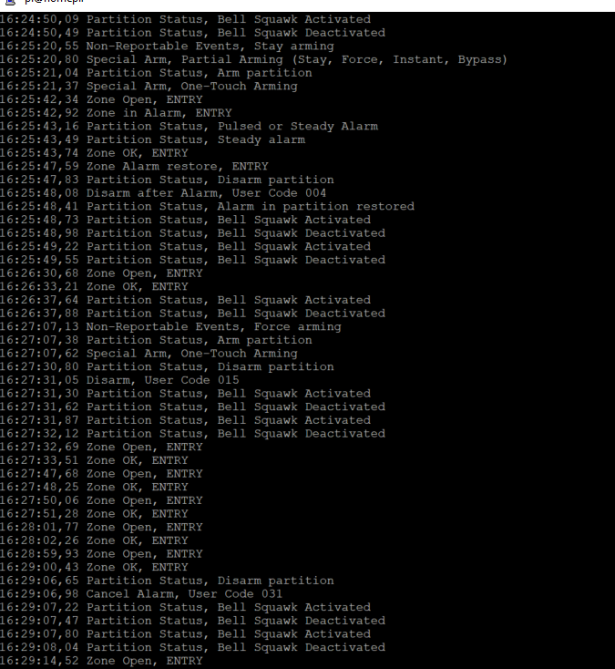

# Paradox Spectra 1738 Serial Output Reverse Engineering
Reverse engineering of Paradox Spectra 1738 Security System Serial Output and reading it from Raspberry PI.

## Paradox Spectra 1738 serial output
Spectra 1738 serial output is 4 bytes. Look at the tables by the end of this doument.

- **Byte 1** is an event.
- **Byte 2** is a message like zone number, user, status, trouble info.
- **Byte 3, Byte 4** are used for clock.

## Connect Paradox serial output to Raspberry PI
To read Paradox security messages by Raspberry PI we have to connect these two hardware devices.</br> 
Both devices have a serial input/output IO (COM ports). Serial interface is using one wire to send data
and another wire to receive data. 
As it is unknown how to send commands to Paradox we need only one wire for communication. 
Obviously we need additional wire for ground connection.
Data transmitted from Paradox Tx pin (transmit) to Raspberry Rx pin (receive).</br>
As Paradox Tx output is 5V and Raspberry Rx is 3,3V we can't connect them directly.</br>
**DO NOT CONNECT Tx directly to Rx, this will damage your Raspberry!**</br>
Usual recommendation is to use a special 5v to 3,3v converter. 
As I do not have this converter and the electric current is very small then simple voltage divider with a two resistors is good to go.


## Read serial messages in Raspberry
This is my very first project to deal with a COM-port and serial messages. Therefore I start at the beginning and
creating a foreach loop to see is there any COM-ports presented in my Raspberry. 
#### Find Raspberry COM port
This foreach loop list all available COM-ports presented by Raspberry.
If there is no COM-port available then this have to be enabled from the Raspberry global settings raspi-config.
Keep in mind that SerialPort is exist in System.IO.Ports whichcan be downloaded as NuGet package.

```C#
string[] ports = SerialPort.GetPortNames();
Console.WriteLine("The following serial ports are found:");
foreach (string port in ports)
{
    Console.WriteLine(port);
}
// The following serial ports are found:
// /dev/ttyAMA0
```
#### Create and open COM port
The next task is to write some lines of code to create a COM port which we can use for reading serial messages.

```C#
string ComPort = "/dev/ttyAMA0";
int baudrate = 9600;
Console.WriteLine($"serial: {ComPort} {baudrate}");
_serialPort = new SerialPort(ComPort, baudrate);
_serialPort.Open();
```
#### Read serial messages 
As Paradox messages are always 4 bytes they needs to be read in batches of 4 bytes. 
Following piece of code is doing exactly this and the data stream is saved into byte array DataStream[].
Now the rest of the work is simple reading these bytes and do some smart decisions. 
```C#
byte[] DataStream = new byte[4];
byte index = 0;
while (true)
{
     //Spectra message output is always 4 bytes
    if (_serialPort.BytesToRead < 4)
    {
        index = 0;
        while (index < 4)
        {
            DataStream[index++] = (byte)_serialPort.ReadByte();
        }
    }
}
```
---
## <center>Byte 1</center>

Byte 1 is an event. These events are categorized based on message context. 
* Zones: zone open, closes, alarms in zone.
* Statuses: all kind of messages related arming, disarming etc.
* Users: which user code has been used for arming/disarming.
* Troubles: some trouble messages, havent seen any.

```C#
string EventID = DataStream[0].ToString("X2");
string Event = events.Where(x => x.Data == EventID).Select(x => x.Name).DefaultIfEmpty($"NoName {EventID}").First();
int EventCategory = events.Where(x => x.Data == EventID).Select(x => x.Category).DefaultIfEmpty(DataStream[0]).First();

bool isZoneAction = EventCategory == Category.SENSOR;
bool isUserAction = EventCategory == Category.USER;
bool isTrouble = EventCategory == Category.TROUBLE;
bool isStatus = EventCategory == Category.STATUS;
```
---
## <center>Byte 2</center> 

Byte 2 is a message like zone number, user info, status info, trouble info.</br>
Messages are displayed based on the event category.
```C#
if (!isStatus)
    Console.Write($" {Event}");

if (isZoneAction)
    Message = sensors.Where(x => x.Data == MessageID).Select(x => x.Name).DefaultIfEmpty($"NoName {MessageID}").First();

if (isStatus)
    Message = statuses.Where(x => x.Data == MessageID).Select(x => x.Name).DefaultIfEmpty($"NoName {MessageID}").First();

if (isTrouble)
    Message = troubles.Where(x => x.Data == MessageID).Select(x => x.Name).DefaultIfEmpty($"NoName {MessageID}").First();

if (isUserAction)
    Message = $"User:{MessageID}";

Console.Write($" {Message}");
```
Following is the output of this program.</br>


---
## <center>Bytes 3 and Bytes 4 are octal clock</center>

Nice reverse engineering task was to figure out how the clock is working. 
This is completely useless as it reads just the time reported by Paradox panel (24h format). 
It is useless because after integration the clock is managed anyway by Rasperry PI.
Still, to solve this mathemathical clock challenge I built first the clock generator.
During this work I realized that the clock is based on octal numeric system. 
Huhh, crazy thing. Do you know what is Octal numeric system? The numbers are going up only to 7 and after that comes 10. 
>Octal 0,1,2,3,4,5,6,7,10,11,12,13,14,15,16,17 ...

The Octal Clock project with the generator.</br>
https://github.com/LeivoSepp/Octal-Clock-Two-Bytes-24h </br>

Some time examples:
* time 23:59 is in Octal 273 260 and in Hex 0xBB 0xB0.
* time 8:00 is in Octal 100 and in Hex 0x08.
* time 20:00 is in Otal 240 and in Hex 0xA0.

The final solution is a genius as it has just two lines of code (hours and minutes) with little mathematics. </br>

```C#
int msb = inData[2];
int lsb = inData[3];

//thats a clock, nice reverse engineering from octal logic
int hour = msb / 8;
int minute = msb % 8 * 16 + lsb / 16;

TimeSpan time = new TimeSpan(hour, minute, 0);
DateTime dateTime = DateTime.Now.Date.Add(time);
Console.Write($"{dateTime:t} ");
```
## Reverse engineering with oscilloscope
This is my first experiment with serial communication. I never worked before with the old COM-technology.
I connected my digital oscsilloscope directly to Paradox Tx serial output.
When I finally figured out which pin is the Txand and started to see real packets on my laptop, I enjoyed this like a child.</br>
There are some projects in GitHub related to Paradox security system but no one is for this 20 years old system.
The first task was to understand that all packets are exactly 4 bytes. 
I realized very quickly some data patterns when IR detectors are active. </br>
**That was like a magic.**


## Security system and Home Automation
The next task is to integrate the Paradox to Home Automation through the COM port. 

#### What is the benefit of the integration?
Everything which is related to human presence and location in house can be automated. </br>
I have already implemented following scenarios.
* **Garden lights.** If someone is at home then garden lights are turned on automatically. Algorithm is the following.
  * Lights are turned on in between sunset and sunrise.
  * Lights are turned off during sleeping time 00:00-07:00
  * Lights are turned off if nobody is at home in 1 hour. Detected by IR detectors.
* **Entry-Exit patterns.** If someone leaves or enters the house then the direction of movement is detected and reported to home automation. 
* **Security messages.** If home is secured (by Home Automation and not by the Paradox) I will get immediately notification if someone is moving in house.

New ideas of using this Paradox integration.
* Some lights can be turned on/off automatically in house.
  * Corridor light will be the first one. I really miss that.
  * Hall light and some others which needs to be turned on temporarily. 

*Garden lights are automated by Home Automation, Paradox Spectra and IR detectors.*</br>

#### Current integration (holy mess)
The current integration is done in very difficult way. 
All sensors are connected physically to MCP23017 which is a 16 bit parallel I/O expansion.
MCP23017 is connected to Raspberry by I2C protocol. Program is looping these ports in every second to find IR detectors interruptions.</br>
With the new serial port connection I can get rid of hundreds of wires to replace them just with two wires. 
I took some pictures because very soon this mess is not exist anymore. </br>


## Paradox serial output messages explained

<table>
    <tr>
                 <td colspan=2><b>Byte 1</b></ td> 
                 <td colspan=2><b>Byte 2</b></ td> 
                 <td><b>Byte 3</b></ td> 
                 <td><b>Byte 4</b></ td> 
   </tr>
    <tr>
                 <td>Hex</ td>    
                 <td>Event</ td>  
                 <td>Hex</ td>    
                 <td>Message</ td>  
                 <td>Hex</ td>    
                 <td>Hex</ td>  
    </tr>
    <tr>
                 <td>0x00</ td>    
                 <td>Zone Closed</ td>  
                 <td></ td>    
                 <td>Zones table</ td>  
                 <td rowspan=12>Time</ td>    
                 <td rowspan=12>Time</ td>  
    </tr>
    <tr>
                 <td>0x04</ td>    
                 <td>Zone Open</ td>  
                 <td></ td>    
                 <td>Zones table</ td>  
    </tr>
    <tr>
                 <td>0x08</ td>    
                 <td>Status</ td>  
                 <td></ td>    
                 <td>Statuses table</ td>  
    </tr>
    <tr>
                 <td>0x14</ td>    
                 <td>Unknown</ td>  
                 <td>71</ td>    
                 <td>Occurred exactly 00:00</ td>  
    </tr>
    <tr>
                 <td>0x34</ td>    
                 <td>Arming</ td>  
                 <td></ td>    
                 <td>User #</ td>  
    </tr>
    <tr>
                 <td>0x3C</ td>    
                 <td>Disarming</ td>  
                 <td></ td>    
                 <td>User #</ td>  
    </tr>
    <tr>
                 <td>0x40</ td>    
                 <td>Disarming after Aarm</ td>  
                 <td></ td>    
                 <td>User #</ td>  
    </tr>
    <tr>
                 <td>0x50</ td>    
                 <td>Zone in Alarm</ td>  
                 <td></ td>    
                 <td>Zones table</ td>  
    </tr>
    <tr>
                 <td>0x58</ td>    
                 <td>Zone Alarm restore</ td>  
                 <td></ td>    
                 <td>Zones table</ td>  
    </tr>
    <tr>
                 <td>0x70</ td>    
                 <td>Trouble fail</ td>  
                 <td></ td>    
                 <td>Troubles table </ td>  
    </tr>
    <tr>
                 <td>0x74</ td>    
                 <td>Trouble fail restore</ td>  
                 <td></ td>    
                 <td>Troubles table</ td>  
    </tr>
</table>

<table>
    <tr>
                 <td colspan=2><b>**STATUSES**</b> Byte 2</ td> 
   </tr>
    <tr>
                 <td>Hex</ td>    
                 <td>Status</ td>  
    </tr>
    <tr>
                 <td>0x01</ td>    
                 <td>Zones Open</ td>  
    </tr>
    <tr>
                 <td>0x11</ td>    
                 <td>Zones Closed</ td>  
    </tr>
    <tr>
                 <td>0x21</ td>    
                 <td>Alarm/Bell?</ td>  
    </tr>
    <tr>
                 <td>0x41</ td>    
                 <td>Alarm/Bell?</ td>  
    </tr>
    <tr>
                 <td>0x51</ td>    
                 <td>Alarm occurred during arm</ td>  
    </tr>
    <tr>
                 <td>0x61</ td>    
                 <td>Arm Code entered</ td>  
    </tr>
    <tr>
                 <td>0x71</ td>    
                 <td>Arm Code entered</ td>  
    </tr>
    <tr>
                 <td>0x91</ td>    
                 <td>Disarmed</ td>  
    </tr>
    <tr>
                 <td>0xA1</ td>    
                 <td>Armed</ td>  
    </tr>
    <tr>
                 <td>0xB1</ td>    
                 <td>Entry delay started</ td>  
    </tr>
</table>

<table>
    <tr>
                 <td colspan=2><b>**TROUBLES**</b> Byte 2</ td> 
   </tr>
    <tr>
                 <td>Hex</ td>    
                 <td>Trouble</ td>  
    </tr>
    <tr>
                 <td>0x21</ td>    
                 <td>Battery</ td>  
    </tr>
    <tr>
                 <td>0x51</ td>    
                 <td>Bell</ td>  
    </tr>
</table>

<table>
    <tr>
                 <td colspan=2><b>**Zones**</b> Byte 2</ td> 
   </tr>
    <tr>
                 <td>Hex</ td>    
                 <td>Zone</ td>  
    </tr>
    <tr>
                 <td>0x11</ td>    
                 <td>Zone 1</ td>  
    </tr>
    <tr>
                 <td>0x21</ td>    
                 <td>Zone 2</ td>  
    </tr>
    <tr>
                 <td>0x31</ td>    
                 <td>Zone 3</ td>  
    </tr>
    <tr>
                 <td>0x41</ td>    
                 <td>Zone 4</ td>  
    </tr>
    <tr>
                 <td>0x51</ td>    
                 <td>Zone 5</ td>  
    </tr>
    <tr>
                 <td>0x61</ td>    
                 <td>Zone 6</ td>  
    </tr>
    <tr>
                 <td>0x71</ td>    
                 <td>Zone 7</ td>  
    </tr>
    <tr>
                 <td>0x81</ td>    
                 <td>Zone 8</ td>  
    </tr>
</table>

### Resources used during the project
Serial Port Programming With .NET.
Good resource for beginner to understand how to read serial messages.</br>
https://www.instructables.com/Serial-Port-Programming-With-NET/

Serial Communication with .NET Core 3.0 on RPi Linux.
Good build and publish scripts.</br>
https://dev.to/azure/net-core-iot-raspberry-pi-linux-and-azure-iot-hub-learn-how-to-build-deploy-and-debug-d1f </br>
https://www.hackster.io/sxwei123/serial-communication-with-net-core-3-0-on-rpi-linux-0f2ed4

Overall serial communication explanation.</br>
https://learn.sparkfun.com/tutorials/serial-communication/all

Picoscope oscilloscope for serial communication. </br>
https://www.picotech.com/download/datasheets/MM043_PicoScope_Serial_Decoding_Data_Sheet.pdf

Paradox home security hacking for newest devices. Useless to me </br>
https://harizanov.com/2014/07/interfacing-with-paradox-home-security-system-attempt-2/

This project is useless to me as well as it is only for newest systems.</br>
https://github.com/ParadoxAlarmInterface

Raspberry Tx->Rx (5v->3.3v)</br>
https://www.raspberrypi.org/forums/viewtopic.php?t=94042 </br>

Setup WSL (Windows Subsystem for Linux)</br>
https://docs.microsoft.com/en-us/windows/wsl/install-win10?WT.mc_id=devto-blog-dglover </br>
Raspberry headless setup</br>
https://desertbot.io/blog/headless-raspberry-pi-3-bplus-ssh-wifi-setup </br>